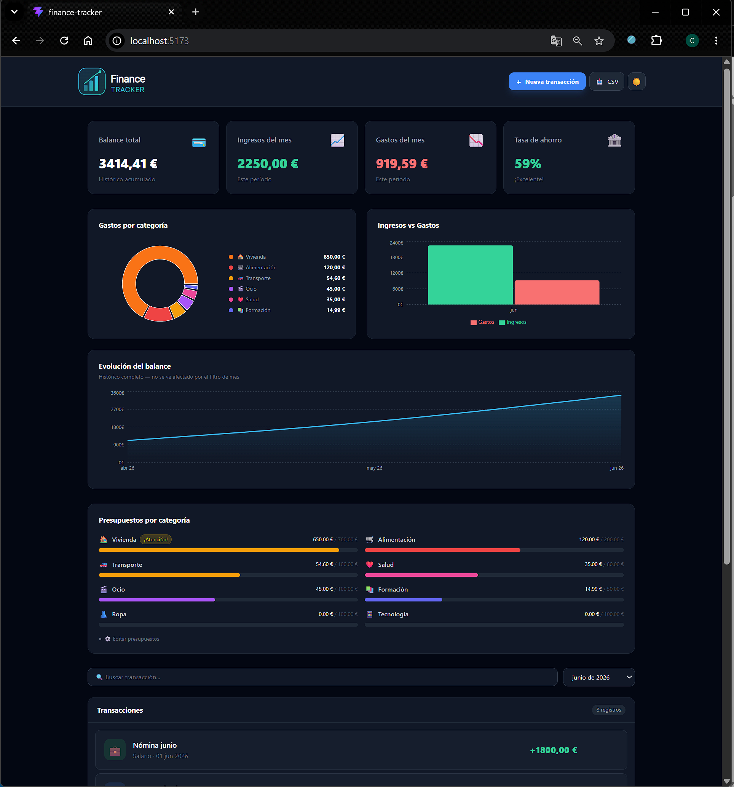

# Finance Tracker

Personal finance dashboard built with React, Tailwind CSS and Recharts.



## Features

- Dashboard with balance, income, expenses and savings rate
- Interactive charts: donut (by category), bar (income vs expenses), area (balance evolution)
- Add, edit and delete transactions
- Filter by month and search by description
- Budget tracker per category with alerts
- Export to CSV
- Dark / light mode
- Data persistence with localStorage
- Responsive design

## Tech stack

- React 19
- Vite
- Tailwind CSS v3
- Recharts (charts)
- Context API + useReducer (global state)
- localStorage (persistence)
- Vercel (deploy)

## Getting started

```bash
npm install
npm run dev
```

## Project structure

```
src/
├── context/
│   └── FinanceContext.jsx   # Global state with useReducer
├── hooks/
│   └── useFinance.js        # Custom hook
├── components/
│   ├── Header.jsx
│   ├── Summary.jsx          # Balance cards
│   ├── Charts.jsx           # Recharts visualizations
│   ├── BudgetTracker.jsx    # Budget progress bars
│   ├── Filters.jsx          # Month filter and search
│   ├── TransactionForm.jsx  # Add transactions modal
│   ├── TransactionList.jsx  # Transaction history
│   └── TransactionItem.jsx  # Single transaction with edit/delete
└── utils/
    ├── categories.js        # Categories and icons
    ├── formatters.js        # Currency and date formatters
    └── exportCSV.js         # CSV export with UTF-8
```

## Live demo

[finance-tracker.vercel.app](https://finance-tracker.vercel.app)

---

Made by [Clara Montaño](https://github.com/claramontano)